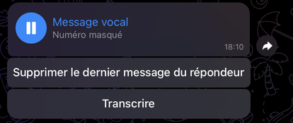
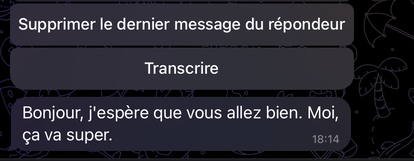
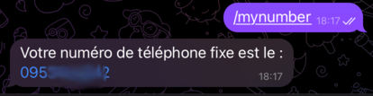
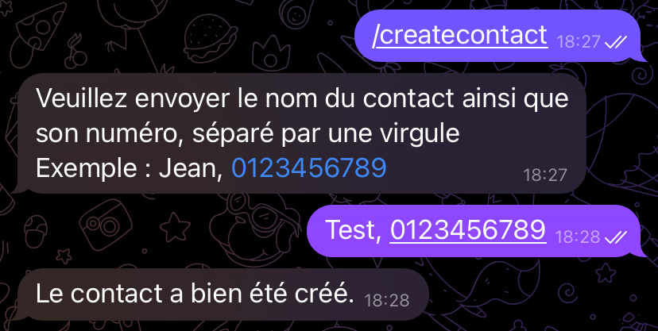
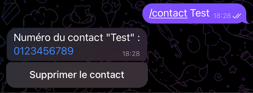
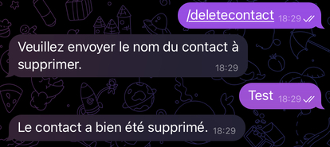

# Freebox Call Notifier — Telegram

## Description

Call Notifier est un bot multi-plateforme vous permettant de recevoir une notification lors d'un appel entrant sur votre Freebox, pour savoir si l'appel vaut vraiment le coup ou non.

Call Notifier vous informe avant même que votre téléphone ne sonne ! Il indique le numéro de téléphone de l'appelant, et le nom de votre contact si celui-ci est enregistré dans le répertoire de la Freebox.

Si vous souhaitez l'hébergez vous même rendez-vous sur le [wiki](https://github.com/Freebox-Tools/telegram-call-notifier/wiki/H%C3%A9berger-soi%E2%80%90m%C3%AAme)

## Plateformes

- [Telegram](https://t.me/freebox_call_notifier_bot)
- [Discord via Bachero](https://github.com/Freebox-Tools/bachero-call-notifier/)

## Fonctionnalités

- Notification instantanée lors d'un appel entrant.

- Envoie un message vocal lorsque votre correspondant laisse un message sur votre répondeur.
  

- Obtenir une retranscription du message laissé sur votre répondeur. (expérimental.)

- Afficher votre numéro de téléphone fixe.
  

- Ajouter un contact dans votre répertoire.
  

- Afficher le numéro de téléphone d'un de vos contacts.
  

- Supprimer un contact de votre répertoire.
  

_____
- Pouvoir activer le WPS et connecter un appareil sans entrer votre mot de passe.

https://github.com/Freebox-Tools/telegram-call-notifier/assets/79168733/a0989d41-48e0-440e-939b-14f46faf965a

*Après exécution de la commande wps.*

## À savoir

- La première connexion doit être effectuée via un ordinateur connecté au même réseau que votre Freebox Server.
- Vous pouvez héberger vous même le bot sur un serveur (voir le wiki), mais l'[API de Call Notifier](https://github.com/Freebox-Tools/api-notifier) devra également être configurée sur un serveur.
- Le bot est hébergé sur une Freebox Delta 24h/24, 7j/7 (merci free).
- La transcription des vocaux utilise [OpenAI Whisper](https://github.com/openai/whisper), qui nécessite Python et ffmpeg.
